 

 

> Computer Science Engineering student focused on practical software, clear systems thinking, and clean, reliable interfaces.

I build software with an emphasis on clarity, structure, and usability. My work spans full-stack applications, APIs, and academic projects, where I focus equally on solid implementation and thoughtful user experience — backed by hands-on experience **deploying production-grade apps**, not just tutorial projects.

- 📍 **Ground Control:** Chennai, Tamil Nadu, India
- 🎓 **Training Base:** B.E. CSE, Madras Institute of Technology, Anna University (2024–2028)
- 🔭 **Current Orbit:** Full-stack + AI-integrated projects
- 🌱 **Next Frontier:** System design, API architecture, clean backend patterns
- ⚡ **Flight Systems:** React/Node.js, Java/Spring Boot, Python

 

## 🪐 Explored Worlds — Projects

<table>
<tr>
<td width="50%" valign="top">

### 🩺 Automated Prescription Digitization
**MERN · Azure Document Intelligence · Groq LLM**

Full-stack platform that digitizes handwritten prescriptions using Azure OCR + Groq LLM parsing — **85%+ extraction accuracy**, with role-based access (Doctor/Patient) via JWT. Independently deployed on an Azure VM with Nginx reverse proxy (SSL/TLS) + PM2.

🔗 [Repository](https://github.com/YazheneS/doctorPrescription)

</td>
<td width="50%" valign="top">

### 💰 PocketCFO — AI Finance Platform
**FastAPI · Chainlit · Ollama · Supabase · Docker**

Modular AI finance platform enabling natural-language transaction logging via an LLM-powered chat interface. FastAPI backend with full CRUD, filtering/pagination, CSV/PDF export; containerized with Docker Compose.

🔗 [Repository](https://github.com/YazheneS/pocketCFO)

</td>
</tr>
<tr>
<td width="50%" valign="top">

### 🚔 Traffic Police Management System
**React · Node.js/Express · MySQL**

Full-stack platform for managing drivers, vehicles, violations, and challans, built across a **5-member team** with domain-based module ownership and a feature-branch/PR workflow across 6 parallel modules.

🔗 [Repository](https://github.com/YazheneS/Traffic-police-management-system)

</td>
<td width="50%" valign="top">

### 🏫 Club Management System
**JavaScript · Firebase · Firestore** *(GDG Hackathon)*

Full-stack club/event management app built at a Google Developer Groups hackathon. Real-time Firestore sync, Cloud Functions for registration limits/notifications, role-based security rules.

🔗 [Repository](https://github.com/YazheneS/club-management)

</td>
</tr>
<tr>
<td width="50%" valign="top">

### 🍽️ Menu Management API CRUD
**REST API · CRUD · Backend**

Backend service for structured menu data handling with a clean, API-driven CRUD workflow.

🔗 [Repository](https://github.com/YazheneS/Menu-Management-API-CRUD)

</td>
<td width="50%" valign="top">

### 📊 Student Result Report Generator
**Automation · Reporting · Data Handling**

Automates generation of student result summaries and reports from structured data.

🔗 [Repository](https://github.com/YazheneS/Student-result-report-generator)

</td>
</tr>
</table>

 

## ⚙️ Onboard Systems — Tech Stack

  
**Languages**
 

**Frontend**
 

**Backend**
 

**Databases**
 

**Mission Control (Cloud & Tools)**
 

 

📫 **yazh.yazhene@gmail.com** &nbsp;|&nbsp; **[linkedin.com/in/yazhene-s](https://www.linkedin.com/in/yazhene-s/)** &nbsp;|&nbsp; 🌐 **[yazhenes-portfolio.vercel.app](https://yazhenes-portfolio.vercel.app/)**

